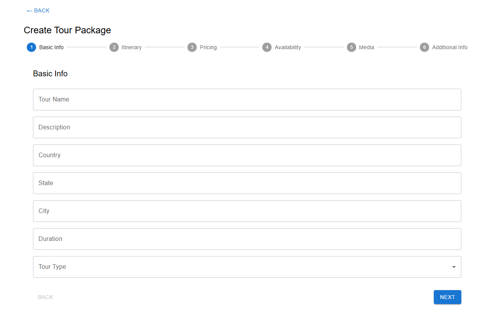
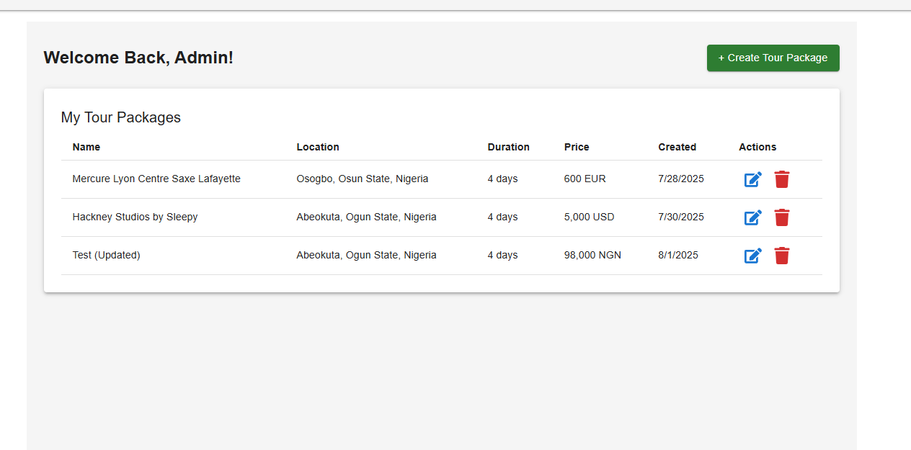
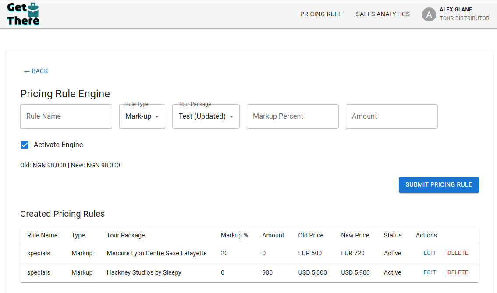
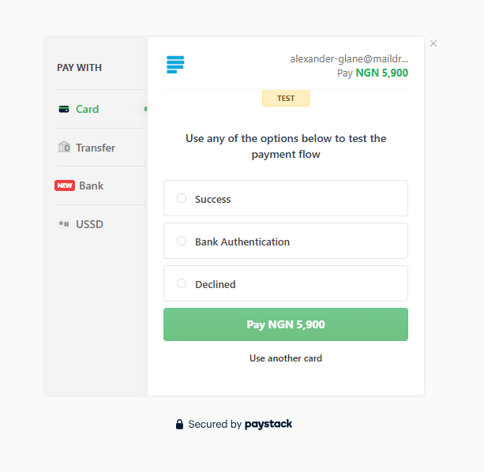

## 🧳 Tour Manager Mini Booker
A simplified tour booking platform showcasing user booking flows, Paystack payment integration, real-time availability, and approval management — built with React, Node.js, MongoDB.

### 🔗 Live Demo
https://tour-nest-pi.vercel.app

### 🖥️ Tech Stack
- **Frontend:** React, MUI, Formik, Yup, React Router
- **Backend:** Node.js, Express, MongoDB, Mongoose
- **Payments:** Paystack
- **Other:** Cloudinary, JWT Auth, LocalStorage Drafts

### 📦 Key Features
- Book real tour packages with live price adjustments
- Handle user bookings with Paystack payments
- Tour owner dashboard to approve or reject bookings
- Real-time availability management
- Clean UI + step-based booking flow

### 📸 Screenshots
**1. Tour Booking Stepper**


**2. Tour Owner Dashboard**


**3. Pricing Rule Engine**


**4. Paystack Payment Screen**


### 📁 Folder Structure
Hybrid = Feature-based + Shared UI

### 💡 Real-World Usefulness
- Mimics actual tour aggregator platforms
- Demonstrates common workflows: pricing, booking, payments, approvals
- Suitable for marketplace-style platforms

### 🏃‍♂️ Getting Started
```bash
git clone https://github.com/yourhandle/tour-mini-booker
cd tour-mini-booker
npm install && npm run dev
```
